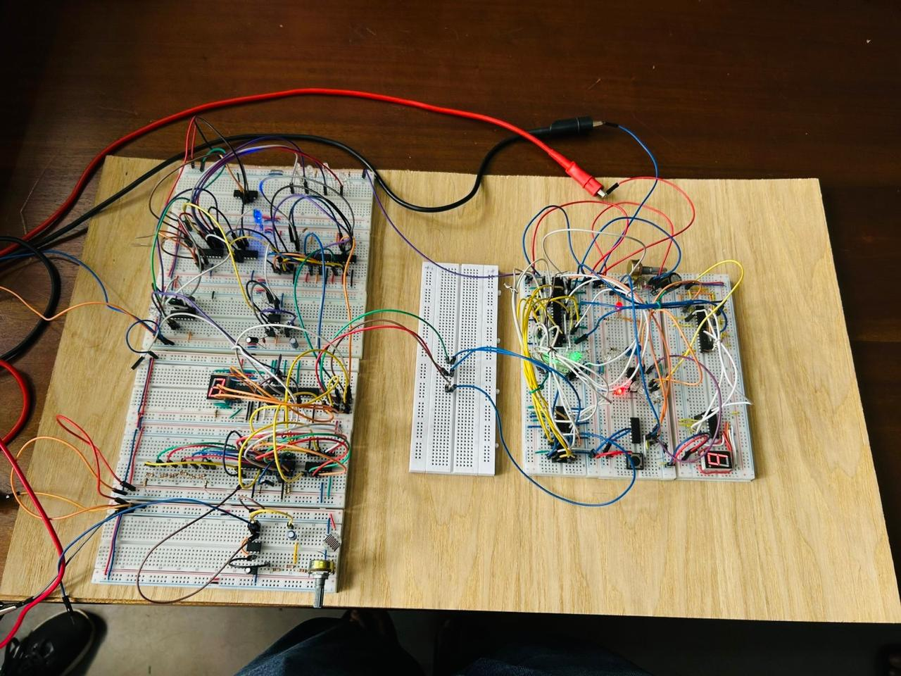

# Advanced Light Intensity Indicator

## Overview
This project is a Digital Signal Processing (DSP) based Advanced Light Intensity Indicator. It measures ambient light intensity using an LDR sensor and applies signal averaging to improve measurement accuracy.

## Features
- Real-time light intensity measurement
- Noise reduction using signal averaging
- Seven-segment display output
- Stable and accurate readings

## Technologies Used
- Digital Signal Processing (DSP)
- LDR Sensor
- Digital Electronics
- Seven-Segment Display
- Falstad Circuit Simulator

## Files
- Project Report (PDF)
- Falstad Circuit Simulation
- Circuit Diagram
- Hardware Images

## Author
Electrical Engineering Undergraduate  
University of Moratuwa

.jpeg)
